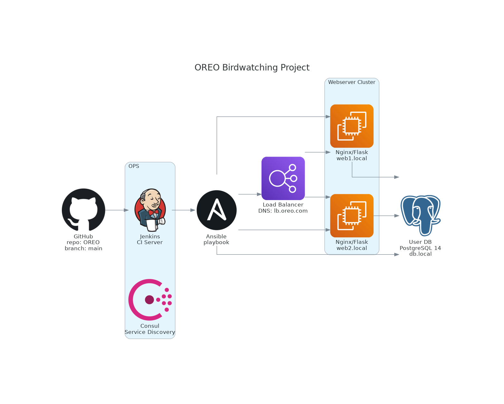

# Birds Project

The Birbs application is created to share photos and location for various bird species, deployed using a fully provisioned infrastructure.

## Project infrastructure



## Prerequisites for installation
To set up the infrastructure defined by this project, you must have the following tools installed locally:

* VirtualBox** (or a similar hypervisor)
* Vagrant


The infrastructure includes: 2 Web VMs, 1 Load Balancer (LB), 1 Database (DB), and 1 Jenkins server. The configuration is defined in the `Vagrantfile`.


### Environment Variables

To run the application, you need to add the secret environment variables. Please check the Ansible template for expected values in `.env.j2`: `SECRET_KEY`, `SQLALCHEMY_DATABASE_URI`, `ADMIN_PASSWORD`


## Local installation

1.  Start VMs: From the root directory, start all five virtual machines:
    ```bash
    vagrant up
    ```
2. Access Jenkins: Go to the Jenkins server, which is accessible on port `8080`. Log in with your default user credentials.
3. Add Credentials: Add your *GitHub Personal Access Token (PAT)* to Jenkins Credentials for secure repository connection and cloning.
4. Create Pipeline: Create a new Jenkins Pipeline job based on the `Jenkinsfile` in this repository.
5. Run Pipeline: Execute the pipeline job. This process will apply the Ansible configuration to the Web, DB, and Load Balancer VMs.

**For detailed setup instructions, please check the **RUNBOOK.md** file.*

## Usage
The Ansible configuration automatically starts the Flask service.

The application is accessible on port `5000`

## License
MIT License - see the **[LICENSE](LICENSE)** file for details.